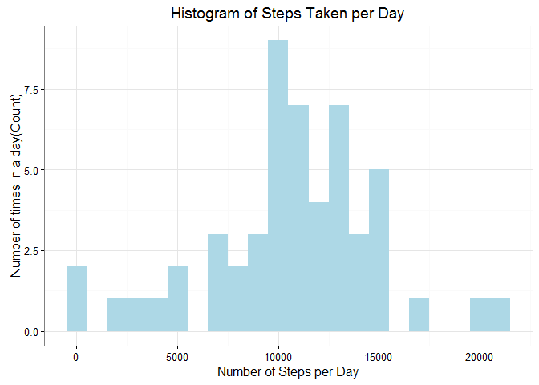
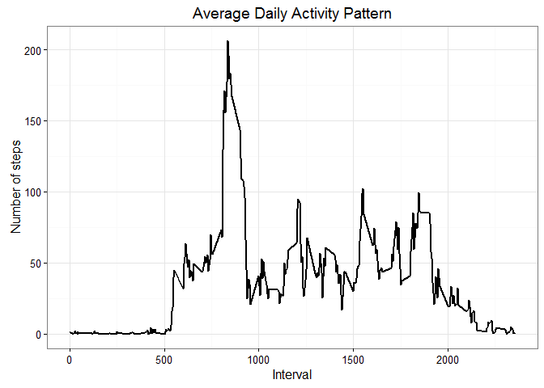
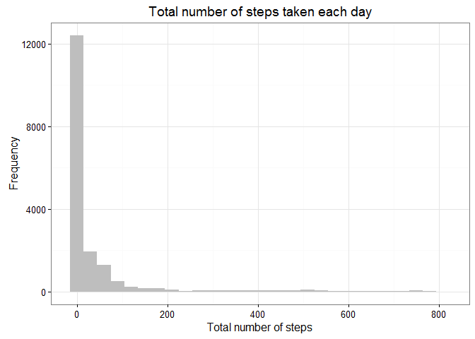
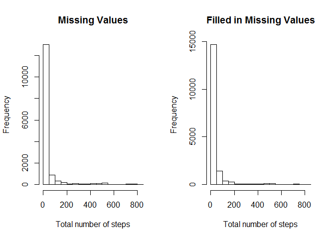
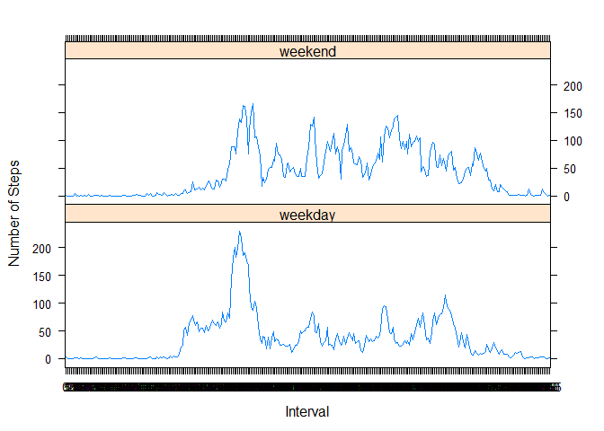

# Reproducible Research: Peer Assessment 1


## Loading and preprocessing the data

```r
library(knitr)
opts_chunk$set(echo = TRUE, results = 'hold')
library(data.table)
```

```
## Warning: package 'data.table' was built under R version 3.2.4
```

```r
library(ggplot2)
library(lattice)
rdata <- read.csv('activity.csv', header = TRUE, sep = ",", colClasses=c("numeric", "character", "numeric"))
rdata$date <- as.Date(rdata$date, format = "%Y-%m-%d")
rdata$interval <- as.factor(rdata$interval)
steps_per_day <- aggregate(steps ~ date, rdata, sum)
colnames(steps_per_day) <- c("date","steps")
```
### histogram of the total number of steps taken each day

```r
stepsperdayplot <-  ggplot(steps_per_day, aes(x = steps)) + 
                    geom_histogram(fill = "lightblue", binwidth = 1000) + 
                    labs(title="Histogram of Steps Taken per Day", 
                    x = "Number of Steps per Day", y = "Number of times in a day(Count)") + theme_bw() 

plot(stepsperdayplot)
```


## What is mean total number of steps taken per day?

```r
steps_mean   <- mean(steps_per_day$steps, na.rm=TRUE)
steps_median <- median(steps_per_day$steps, na.rm=TRUE)
meanmedian <- data.frame(mean = steps_mean, median = steps_median)
meanmedian
```

```
##       mean median
## 1 10766.19  10765
```
## What is the average daily activity pattern?
### Code to find the steps per interval and change it to intergers for plotting

```r
steps_per_interval <- aggregate(rdata$steps, by = list(interval = rdata$interval),FUN=mean, na.rm=TRUE)
steps_per_interval$interval <- as.integer(levels(steps_per_interval$interval)[steps_per_interval$interval])
colnames(steps_per_interval) <- c("interval", "steps")
```
### time series plot of the 5-minute interval (x-axis) and the average number of steps taken, averaged across all days (y-axis)

```r
stepsperinterval <- ggplot(steps_per_interval, aes(x=interval, y=steps)) +   
  geom_line(color="black", size=1) +  
  labs(title="Average Daily Activity Pattern", x="Interval", y="Number of steps") + 
  theme_bw()
plot(stepsperinterval)
```


### find the max interval of steps

```r
max_interval <- steps_per_interval[which.max(steps_per_interval$steps),]
max_interval
```

```
##     interval    steps
## 104      835 206.1698
```
## Imputing missing values

```r
missing_vals <- sum(!is.na(rdata$steps))
missing_vals
```

```
## [1] 15264
```
### get the mean to replace the NA values based on the 5 minute interval

```r
meanStepsByInterval <- tapply(rdata$steps, rdata$interval, mean, na.rm = TRUE)
```
### find in the rdata set, steps that are NA, date, time interval

```r
 naDataRows <- rdata[is.na(rdata), ]
colnames(naDataRows) <- c("steps","date","interval")
```
### replace the NA's in the naDataRows with the mean data first

```r
for (i in 1:nrow(naDataRows)) {
    naDataRows[i, 1] <- meanStepsByInterval[[toString(naDataRows[i, 3])]]}
```
### copy the original data set into new one and then replace the NA's with naDataRows data

```r
missingdatafilled <- rdata
missingdatafilled[is.na(rdata), 1] <- naDataRows[,1]
```
### create histogram of the new data without NA's

```r
allfilledstepsperdayplot <-  ggplot(missingdatafilled, aes(x = steps)) + 
                            geom_histogram(fill = "gray", binwidth = 30) + 
                            labs(title="Total number of steps taken each day", 
                            x = "Total number of steps", y = "Frequency") + theme_bw() 

plot(allfilledstepsperdayplot)
```


### find the mean/median of the all data filled in with the means per time interval

```r
alldatafilledmean <- mean(missingdatafilled$steps, na.rm = TRUE)
alldatafilledmedian <- median(missingdatafilled$steps, na.rm = TRUE)
alldatafilledmm <- data.frame(mean = alldatafilledmean, median = alldatafilledmedian)
alldatafilledmm
```

```
##      mean median
## 1 37.3826      0
```
## Do these values differ from the estimates from the first part of the assignment?
### The mean and median stayed the same in both tests

## What is the impact of imputing missing data on the estimates of the total daily number of steps?
### Shown in the different histograms the frqency was increased with adding the missing data with the means

```r
par(mfrow = c(1, 2))
hist(rdata$steps, xlab = "Total number of steps", main = "Missing Values")
hist(missingdatafilled$steps, xlab = "Total number of steps", main = "Filled in Missing Values")
```


### Create a new factor variable in the dataset with two levels - "weekday" and "weekend" indicating 
### whether a given date is a weekday or weekend day.

```r
filledweekdays <- weekdays(missingdatafilled$date)
weekendsfilled <- (filledweekdays == "Sunday" | filledweekdays == "Saturday")
missingdatafilled$factoredweek <- factor(weekendsfilled,labels = c("weekday","weekend"))
daygroupeddata <- aggregate(missingdatafilled$steps, list(DayType = missingdatafilled$factoredweek, 
                                                          Interval = missingdatafilled$interval),mean)
colnames(daygroupeddata) <- c("DayType","Interval","Steps")
```
## Are there differences in activity patterns between weekdays and weekends?
### Graph the weekend vs weekday for steps

```r
xyplot(daygroupeddata$Steps ~ daygroupeddata$Interval | daygroupeddata$DayType, layout = c(1, 
    2), xlab = "Interval", ylab = "Number of Steps", type = "l")
```


